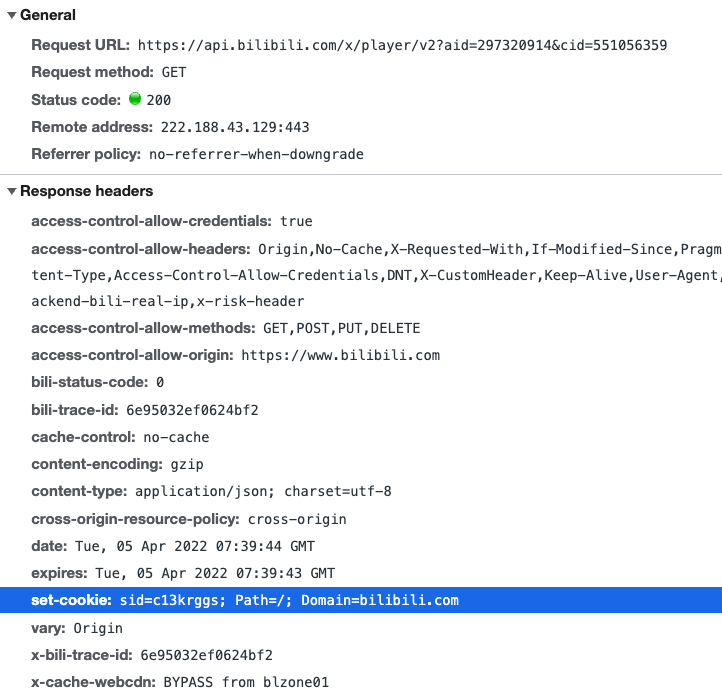
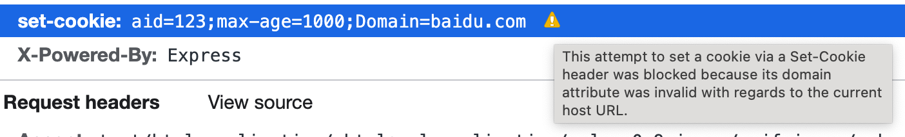
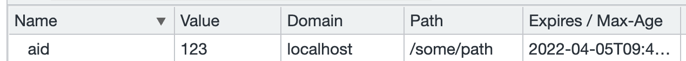

# Cookie

Category: Broswer
Priority: ⭐️⭐️⭐️⭐️⭐️
Property: April 17, 2022 6:49 PM
Status: 已完成

# 历史

由网景公司1993发明，是网站为了辨别用户身份而存储在终端的一段数据。

由于 HTTP 协议是无状态的，导致Web应用的交互能力很差，Cookie 就是用来解决 HTTP 无状态性的重要手段。

同时由于 Cookie 通常用来作为用户标记，所以也成为前端安全领域的重要一块。

*在有了 Cookie 以后，后续又出现了 同源策略（SOP） 来加强 Cookie 的安全，之后又出现了 CORS 和 CSP 这些关于资源访问权限的配置规范。同时，大量的以盗用 Cookie 为目标的 XSS、CSRF 攻击也出现了。*

---

# 通常作用

它的核心是告诉服务端，这个请求是来自于哪个浏览器。

包括它的实际落地场景：

- 会话状态管理（如用户登录状态、购物车、游戏分数或其它需要记录的信息）
- 个性化设置（如用户自定义设置、主题等）
- 浏览器行为跟踪（如跟踪分析用户行为等）

它的本质都是通过 Cookie 告诉了服务器「我是谁」

---

# 创建 Cookie

通过服务器在 HTTP Response Header 中设置对应的字段来实现，比如在B站的页面中：



在未登录的状态下，服务端设置向浏览器设置了一个「sid」的cookie

```
set-cookie: sid=c13krggs; Path=/; Domain=bilibili.com
```

<aside>
👨🏻‍💻 它没有设置过期时间，且这个请求没有有效的 response body。可以猜测这个 sid 是用来追踪未登录用户的行为。

</aside>

之后再看后续的请求，就会发现这个 Cookie 已经被带上

# 属性

标准文档

[Set-Cookie - HTTP | MDN](https://developer.mozilla.org/zh-CN/docs/Web/HTTP/Headers/Set-Cookie)

```
Set-Cookie: <cookie-name>=<cookie-value>; Expires=<date>
Set-Cookie: <cookie-name>=<cookie-value>; Max-Age=<non-zero-digit>
Set-Cookie: <cookie-name>=<cookie-value>; Domain=<domain-value>
Set-Cookie: <cookie-name>=<cookie-value>; Path=<path-value>
Set-Cookie: <cookie-name>=<cookie-value>; Secure
Set-Cookie: <cookie-name>=<cookie-value>; HttpOnly
```

最简单的设置方法是

```jsx
// 这样设置的是一个临时 cookie，存储在内存中，浏览器关闭以后 cookie 就会失效
set-cookie: sid=1234;
```

## 有效期  Expires/Max-Age

设置 Cookie 的 Expires 属性，会使得：

1. cookie 变成持久 cookie，它不会随着浏览器关闭而失效
2. cookie 到指定的过期时间后会失效

~~而设置 max-age 不会使 cookie 持久化，但是有时效限制的功能。~~

实测发现，如果只设置 cookie 的 max-age，其实也会被浏览器转化为 expires 属性存储。

```jsx
// 这样设置的是一个持久 cookie，能够一直生效到指定时间
set-cookie: sid=1234;expires=Wed, 21 Oct 2020 07:28:00 GMT; // HTTP Date 规范
set-cookie: sid=1234;max-age=60;  // 单位为秒
```

- expire 的内容应该符合 [HTTP Date 规范](https://developer.mozilla.org/zh-CN/docs/Web/HTTP/Headers/Date)，js 里面可以通过 `Date.prototype.toUTCString()` 获得
- 当 max-age 和 expire 同时存在时，以 max-age 为准。

<aside>
👨🏻‍💻 相关实验：

[Cookie expires 和 max-age 实验](https://www.notion.so/Cookie-expires-max-age-92917929d5f2461696ab3211e06c070a)

</aside>

## 作用域 Domain/Path

`Domain` 和 `Path` 标识定义了Cookie的*作用域：*即允许 Cookie 发送给哪些URL。

### Domain

`Domain` 指定了哪些域名会带上 Cookie。

如果不指定，浏览器会默认将其设为当前 URL 的一级域名，比如`[www.example.com](http://www.example.com/)`会设为`[example.com](http://example.com/)`，而且以后如果访问`[example.com](http://example.com/)`的任何子域名，HTTP 请求也会带上这个 Cookie。

如果指定了`Domain`，则一般包含子域名。

通常我们通过设置 Domain 来让一段 Cookie 在同站点共享（登录态）

> 大多数浏览器都遵循 RFC 规范，设置 Domain 时不需要加前导的点。
Domain=.azi.com 和 Domain=azi.com 作用一致。
> 

### Path

指定了主机下的哪些路径可以接受 Cookie（该 URL 路径必须存在于请求 URL 中）。

在 Domain 满足的情况下，`Path`属性是 HTTP 请求路径的开头一部分，就会在头信息里面带上这个 Cookie。

以字符 `%x2F`("/") 作为路径分隔符，子路径也会被匹配。

<aside>
❓ **这里想到一个问题是：如果 Domain 和 Path 随意写会怎么样？**
实测发现，如果向其他域名写 cookie，浏览器会拦截：



而对 Path 则无限制：



</aside>

## SameSite

决定了请求跨站点时能否携带 Cookie

它可以用来阻止 CSRF 攻击

有三个值：

1. `None`
浏览器会在同站请求、跨站请求下继续发送 cookies。
2. `Strict`
浏览器将只在访问相同站点时发送 cookie。
「相同站点」参考 [Site](https://developer.mozilla.org/en-US/docs/Glossary/Site) 的定义。

<aside>
💡 SameSite 和 Same-Origin 的区别？
Same-Origin 的定义很明确：协议、域名、端口都一致的就是 Same-Origin;
SameSite 则宽泛一些，它不要求协议，也不要求端口，只需要根域名一致就认为是 SameSite。
当然这里的根域名需要是「可注册的」，参看原文：
`a site is determined by the ***registrable domain***
 portion of the domain name.`
什么叫可注册的？
`.com` `.edu.com` 就不叫，而 `[github.com](http://github.com)` `[bilibili.com](http://bilibili.com)` 就算。

</aside>

1. `Lax`
与 **`Strict`**  类似，大多数情况也是不发送第三方 Cookie，但是导航到目标网址的 Get 请求除外。 在新版本浏览器中，为默认选项。
    
    
    | 请求类型 | 示例 | None | Lax |
    | --- | --- | --- | --- |
    | 链接 | `<a href="..."></a>` | 发送 Cookie | 发送 Cookie |
    | 预加载 | `<link rel="prerender" href="..."/>` | 发送 Cookie | 发送 Cookie |
    | GET 表单 | `<form method="GET" action="...">` | 发送 Cookie | 发送 Cookie |
    | POST 表单 | `<form method="POST" action="...">` | 发送 Cookie | 不发送 |
    | iframe | `<iframe src="..."></iframe>` | 发送 Cookie | 不发送 |
    | AJAX | `$.get("...")` | 发送 Cookie | 不发送 |
    | Image | `` | 发送 Cookie | 不发送 |

<aside>
❓ 为什么默认是 `Lax` 而非 `Strict` ?
Strict 最为严格，完全禁止第三方 Cookie，但是会造成比较差的用户体验：
比如，当前网页有一个 GitHub 链接，用户点击跳转就不会带有 GitHub 的 Cookie，跳转过去总是未登陆状态。（**referer** 是原站点，导致 Github cookie 没带上）

[](https://www.ruanyifeng.com/blog/2019/09/cookie-samesite.html)

</aside>

## 限制访问 Secure/HttpOnly

### Secure

标记为 `Secure` 的 Cookie 只应通过被 HTTPS 协议加密过的请求发送给服务端，因此可以预防 [man-in-the-middle](https://developer.mozilla.org/zh-CN/docs/Glossary/MitM) 攻击者的攻击。

如果通信是 HTTPS 协议，该开关自动打开。

### HttpOnly

标记为 `Secure` 的 Cookie 会使得JavaScript `[Document.cookie](https://developer.mozilla.org/zh-CN/docs/Web/API/Document/cookie)` API 无法访问带有 `HttpOnly` 属性的cookie；此类 Cookie 仅作用于服务器。

```
Set-Cookie: id=a3fWa; Expires=Wed, 21 Oct 2015 07:28:00 GMT; Secure; HttpOnly
```

# Cookie 的修改

如果服务器想改变一个早先设置的 Cookie，必须同时满足四个条件：Cookie 的`key`、`domain`、`path`和`secure`都匹配。举例来说，如果原始的 Cookie 是用如下的`Set-Cookie`设置的。

```
**Set-Cookie: key1=value1; domain=example.com; path=/blog**
```

改变上面这个 Cookie 的值，就必须使用同样的`Set-Cookie`。

```
**Set-Cookie: key1=value2; domain=example.com; path=/blog**
```

只要有一个属性不同，就会生成一个全新的 Cookie，而不是替换掉原来那个 Cookie。

```
**Set-Cookie: key1=value2; domain=example.com; path=/**
```

上面的命令设置了一个全新的同名 Cookie，但是`path`属性不一样。下一次访问`[example.com/blog](http://example.com/blog)`的时候，浏览器将向服务器发送两个同名的 Cookie。